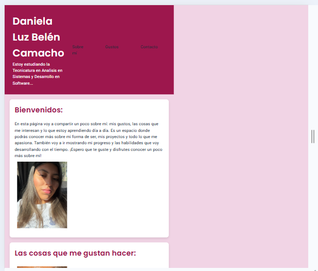

#  Trabajo Práctico N°1

##  Daniela Luz Belén Camacho
### 16/03/2026

##  Descripción
Este proyecto consiste en crear un sitio web básico utilizando HTML5 semántico y estilos CSS3.  
El objetivo fue aprender a estructurar una página web utilizando etiquetas semánticas y aplicar estilos básicos para mejorar su apariencia.

##  Tecnologías usadas 
HTML5   
CSS3  
Visual Studio Code  
Git  
Flexbox, 
Grid
Responsive

##  Sitio en vivo
http://127.0.0.1:5500/index.html

## Capturas
###  Mobile (393px)

###  Tablet (820px)

### 💻 Desktop (1024px)

##  Reflexión
Aprender a usar la terminal es importante porque permite trabajar de forma más rápida y eficiente. Muchas herramientas de programación funcionan directamente desde la terminal y facilitan la automatización de tareas. Además, ayuda a comprender mejor cómo funciona el sistema operativo.  
Aunque exista la interfaz gráfica, la terminal da más control al programador.

## 📂 Ruta
/mingw64/bin/git
